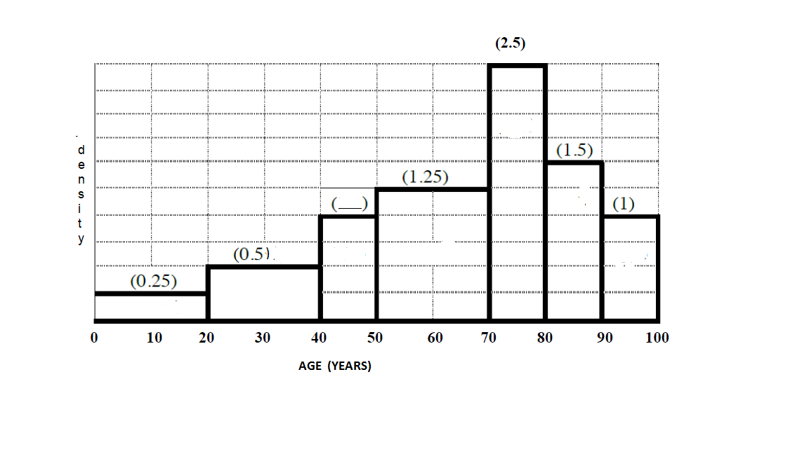

```{r setup, include=FALSE}
knitr::opts_chunk$set(echo = TRUE)

```

* * * 
\begin{shaded}

\textbf{Learning Outcomes}

The problems are designed to build conceptual understanding and problem-solving skills. The emphasis is on learning to find, evaluate and build confidence.
The specific tasks include: 

   - Calculate density in a density histogram
   
   - Calculate probabilities in the uniform and exponential distribution
   
   - Apply the law of the unconscious probabilist for a continuous random variable
  
   - Back up and support work with relevant explanations

 

\end{shaded}


* * *

### Exercises 


1. The distribution of age at death of a large population is shown as a density histogram below. The density of each bin (reported as percentages) is given in parentheses above the block. For example, the density of the bin 70-80 is 2.5% or 0.025. 
   
   Find the density of the 40 - 50 bin. 


```{r echo=F, out.width="80%"}

```


2. Suppose $X$ is uniformly distributed over $[0,1)$. That is
$$f(x) = 1 \ \ \ 0 \leq x < 1.$$
   Show that 
   $$P(-\ln(X) \leq 5) = 1 - e^{-5}$$ 
   where $-\ln(X)$ denotes denotes the natural logarithm of $X$.
   
   
   
3. Among the most famous of all meteor showers are the Perseids, which occur each year in early August. In some areas the frequency of visible Perseids can be as high as forty per hour. Given that such sightings occur according to a Poisson process, the random variable $Y$ which denotes the time (in hours) between consecutive sightings satisfies $Y \sim Exp(\lambda = 40)$.

a. Calculate the probability that an observer who has just seen a meteor will have to wait at least five minutes before seeing another one. Do the calculation analytically (meaning do the integration) and also in R.

b. What is the median length of time (in hours) the observer (from part a) will need to wait before seeing another one? Do the calculation analytically (meaning do the integration) and also in R.

    Note: In R, the natural logarithm function is `log(x, base = exp(1) )`. The argument `base = exp(1)` is actually the default setting. So you can omit specifying it if you like. For example `log(x)` calculates the natural logarithm of $x$
    
    
4. Suppose $X$ is uniformly distributed on $[a, a+1)$ for some $a > 0$, that is, the PDF of $X$ is:
    $$f(x) = 1  \ \ \ \ \ a \leq x < a+1$$
   Show that 
   $$E\left(\frac{1}{X} \right) = 
             \ln\left( \frac{(a+1)}{a} \right).$$
